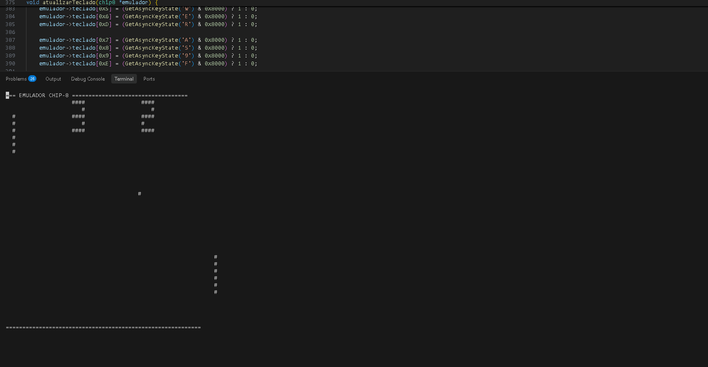

# Professional CHIP-8 Emulator (C++ & Win32 API)

[](README-en.md)
[](README.md)


A fully functional CHIP-8 CPU emulator developed from scratch in modern C++.
This project was built to showcase technical depth in software engineering, moving from a single procedural script to a fully decoupled Object-Oriented Programming (OOP) architecture.

**The Technical Highlight:** Graphical rendering and input handling do not rely on high-level frameworks like SDL2 or SFML. Instead, the emulator communicates directly with the Operating System via the native **Win32 API** (`<windows.h>`), drawing pixels directly to the video memory and ensuring zero external dependencies for compilation.

<p align="center">
  
  <br/>
  <em>Note: You can add a screenshot of the new GUI window running the game here!</em>
</p>

## 🧠 Architecture and Engineering

The project is strictly divided into two main domains (decoupling):

1. **CPU Domain (`Chip8.cpp` & `Chip8.hpp`)**: 
   - Focused entirely on emulating the hardware buses. No code in this layer is aware of the existence of a graphical window or physical keyboard.
   - **RAM Memory:** 4KB (4096 bytes).
   - **Registers:** 16 general-purpose registers (V0 to VF) + 16-bit Index Register (I).
   - **Timers:** Simulated interrupt system for *Delay* and *Sound* running at 60Hz.

2. **Interface Domain (`main.cpp`)**:
   - OS Integration via Win32 API.
   - Window creation using `CreateWindowEx`.
   - Continuous processing of the Windows message queue (`PeekMessage` and `DispatchMessage`).
   - Clock synchronization: The simulated CPU runs at approximately 300Hz, while screen rendering and timers are synchronized at 60Hz.

## How to Compile and Run

No complex tools or CMake installation are required. You only need the G++ compiler (MinGW) installed on Windows.

1. Clone the repository:
```bash
git clone https://github.com/VitorAngN/oldCPUEmulator.git
cd oldCPUEmulator/emular8hd
```

2. Compile using the optimized batch script that automatically handles GDI32 linking:
```bash
# Or simply double-click the build.bat file in Windows Explorer
.\build.bat
```

3. Run by passing the desired ROM as an argument:
```bash
chip8_emulator.exe pong.ch8
```
*(If no argument is passed, it will automatically attempt to load `pong.ch8`).*

## Author

Developed by **João Vitor Angelim Nogueira**.  
Computer Engineering student focused on Software Engineering, Backend, and DevOps, seeking to dive deep from low-level bit manipulation up to complex distributed architectures and robust infrastructure.
